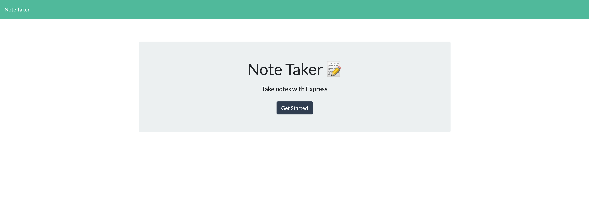
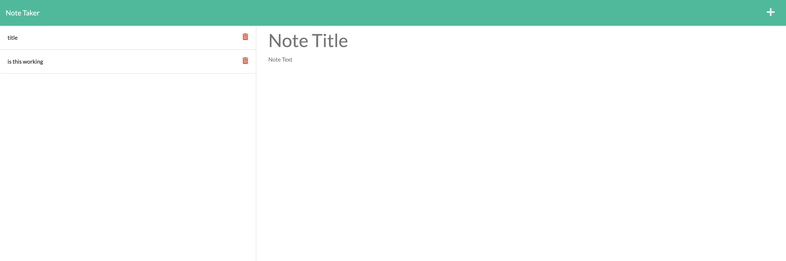

# Notes App

## Description
This application allows the user to create, save and delete notes. It saves the note data in a JSON file. 

## Screenshots

### Homepage

### Notes Page

## Links

[GitHub Repo](https://github.com/webdev410/notes-app)

[Deployed](https://salty-fortress-76405.herokuapp.com/)

### Technologies

* Node.JS
* Express.JS
